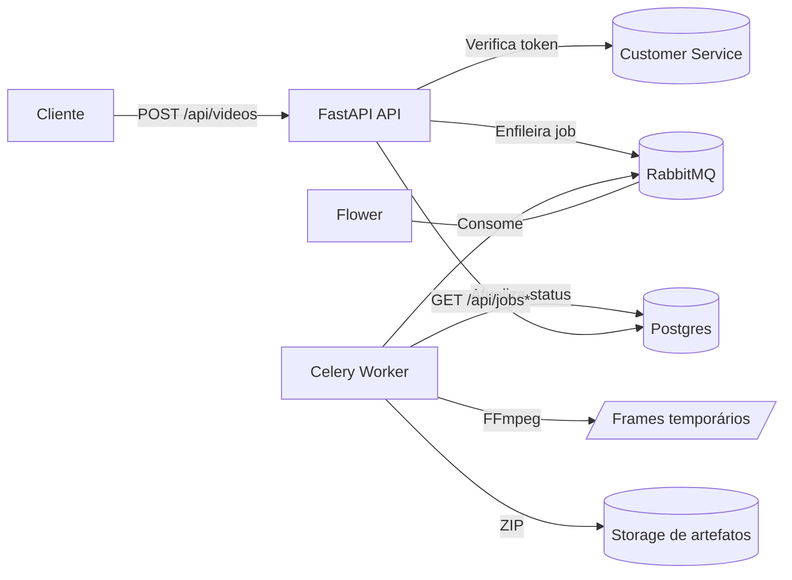

# 🎬 Video Processing Service · FastAPI + Celery + FFmpeg

Processamento **assíncrono** de vídeos: upload autenticado, extração de frames via **FFmpeg**, empacotamento `.zip` e acompanhamento de status — orquestrado com **Celery**, **RabbitMQ** e **Postgres**.

---

## ✨ Recursos

- 🔐 **Autenticação obrigatória** via serviço externo (`CUSTOMER_SERVICE_URL`)
- ⏫ Upload de vídeo → cria **Video** e **Job**
- 🧩 **FFmpeg** extrai frames (`fps` configurável)
- 📦 Geração de **ZIP** com suporte a **Zip64** (arquivos grandes)
- 📊 Acompanhamento em **/api/jobs** e **/api/jobs/{job_id}**
- 🔭 Observabilidade com **Flower** e painel do **RabbitMQ**

---

## 🗺️ Arquitetura (visão rápida)

## ✨ Recursos

app/
  adapters/
    driver/
      api/         # rotas/controllers e dependências (FastAPI)
      worker/      # celery_app e task process_video_job
    driven/
      db/          # models, repositórios SQLAlchemy, Unit of Work
      gateway/     # cliente HTTP para autenticação externa
  domain/
    entities.py    # Video, VideoJob, JobStatus
    ports/         # portas: repos, storage, video_processor, auth, uow
    services/      # enqueue_video.py, process_video.py
  config/
    container.py   # composição/DI dos serviços
